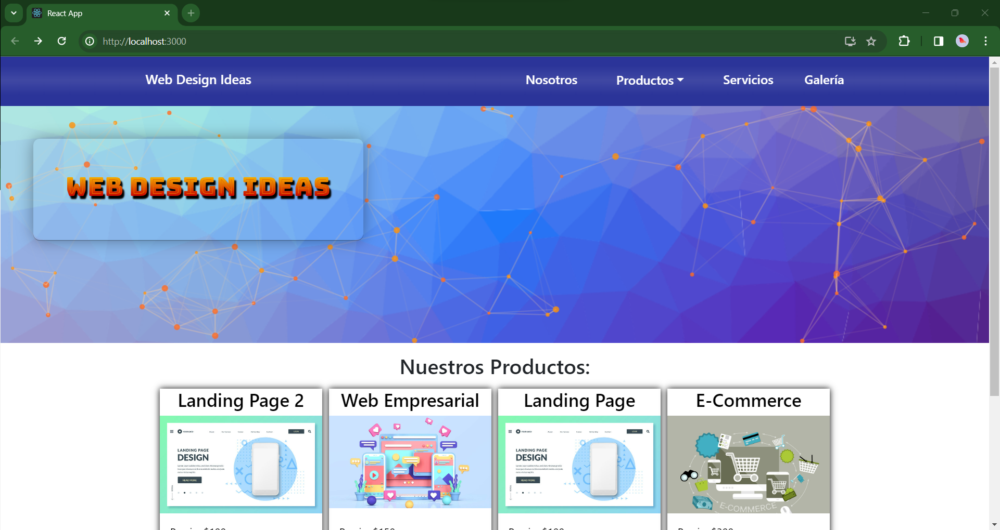
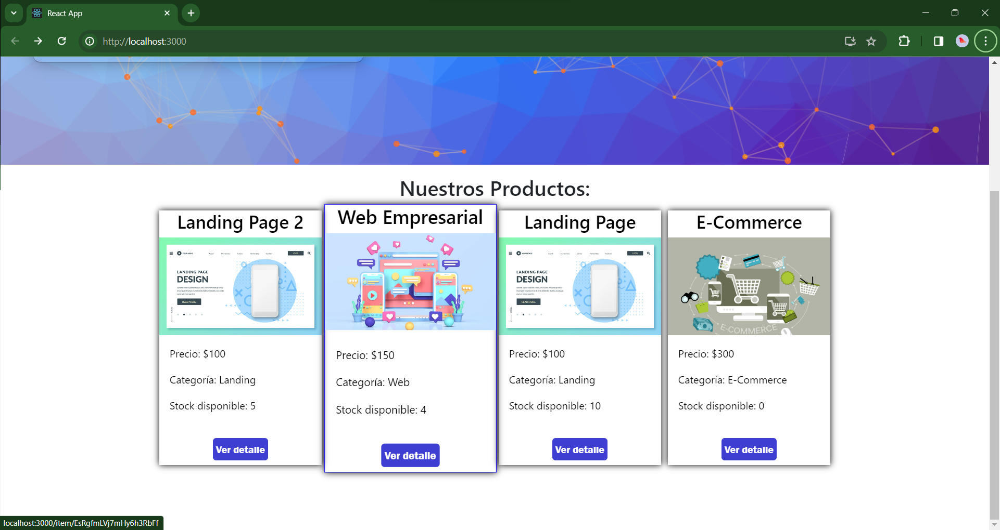
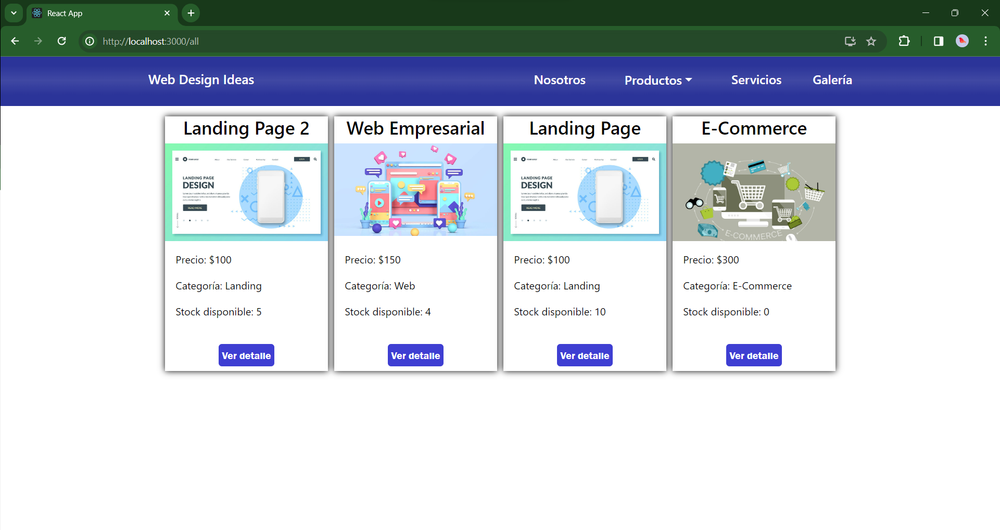
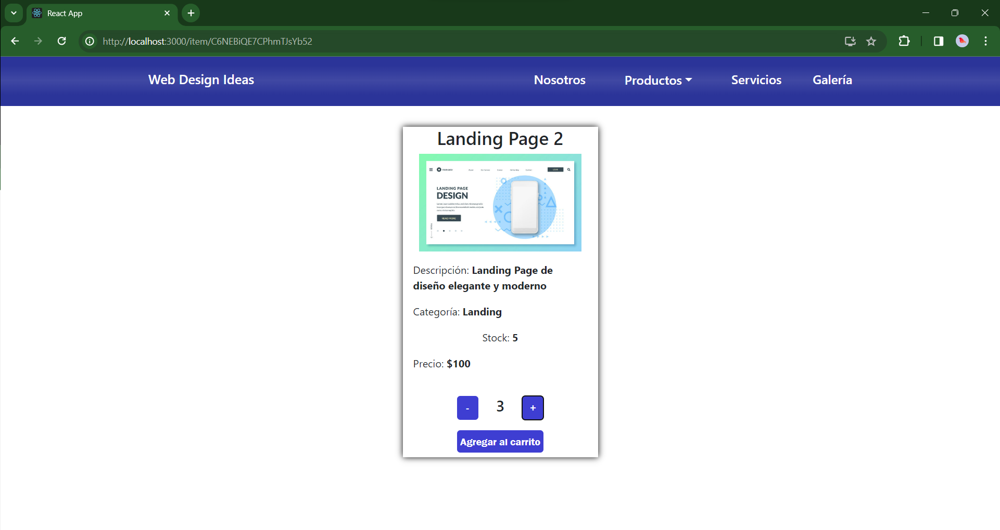
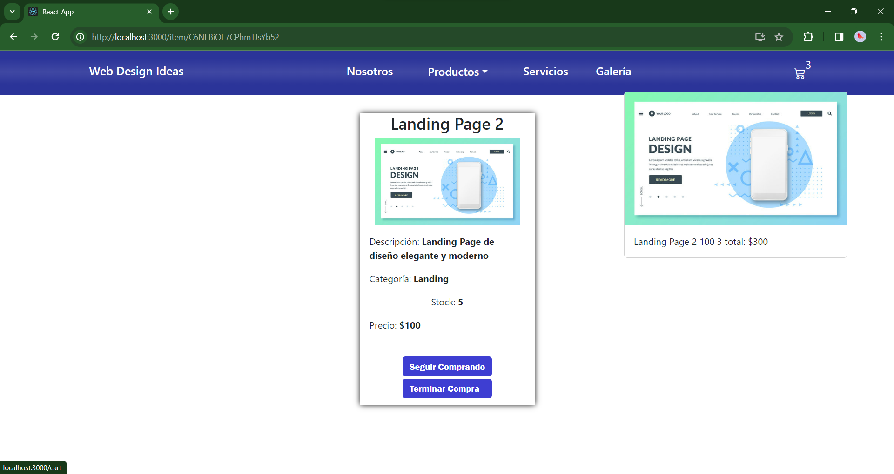
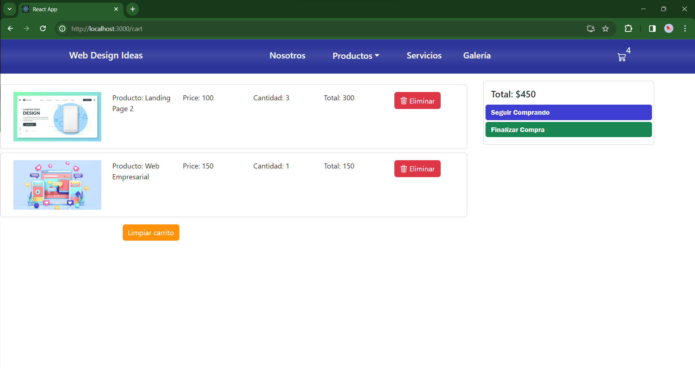
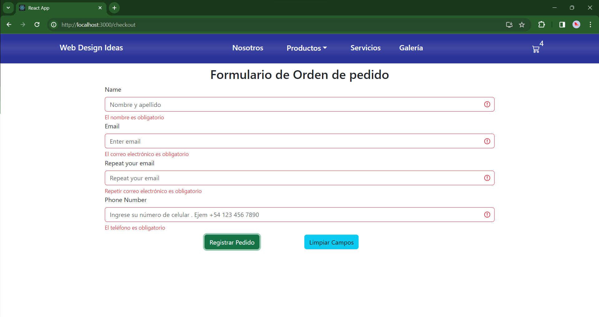

# WEB DESIGN IDEAS

Es una SAP que está construida íntegramente con React, Consiste en una tienda virtual para ofrecer servicios de desarrollo de Software a medida del cliente.

Visita la Demostración en => [WEB DESIGN IDEAS](https://preentrega-finochioadrian-react.vercel.app/).

Se utilizo:
 useState para guardar los estados de los componentes
 useEffect para controlar los efectos secundarios.
 se aplico renderizado condicional para las vistas dinámicas
 useContext para manipular el contexto global y persistir los estados entre renderizado de las vistas

## Tecnologías Utilizadas

- [React](https://es.reactjs.org/): Se eligió React debido a su eficiencia en la construcción de interfaces de usuario interactivas y su capacidad para crear aplicaciones de una sola página (SPA). En el proyecto, React se utiliza para gestionar el estado de los componentes y facilitar la creación de vistas dinámicas.

- [SwetAlert2](https://sweetalert2.github.io/): Esta librería se incorporó para mejorar la presentación de mensajes en la interfaz de usuario. Proporciona una forma atractiva de mostrar alertas y confirmaciones.

- [tsParticle](https://particles.js.org/): tsParticle se implementó para agregar animaciones visuales atractivas en la página principal del proyecto. Esto proporciona una experiencia de usuario más dinámica y agradable.

- [Firebase](https://firebase.google.com/?hl=es): Firebase se utiliza como plataforma de desarrollo para la gestión de la base de datos, autenticación de usuarios, y otras características backend. Proporciona una solución integral y escalable para las necesidades de backend del proyecto.

- [Formik](https://formik.org/): Formik se utiliza para simplificar y gestionar los formularios en la aplicación React. Facilita la validación, manejo de eventos y seguimiento del estado del formulario.

- [Yup](https://github.com/jquense/yup/tree/pre-v1): Yup se utiliza en conjunto con Formik para realizar la validación de los datos ingresados en los formularios. Proporciona una forma declarativa de definir esquemas de validación.

- [React-router-dom V6](https://reactrouter.com/en/main): Esta versión de React Router se utiliza para la gestión de la navegación en la aplicación. Permite definir rutas y navegar entre diferentes vistas de manera eficiente.

- [react-bootstrap](https://react-bootstrap.github.io/): React-bootstrap se integra con React para facilitar el uso de componentes Bootstrap en la aplicación, asegurando una interfaz de usuario consistente y atractiva.

- [bootstrap-icons](https://icons.getbootstrap.com/): Se utiliza para incorporar iconos Bootstrap en la interfaz de usuario, mejorando la usabilidad y el diseño visual de la aplicación.

## Capturas de Pantalla

### Página principal

### Página principal vista productos

### Página todos los productos

### Página item Detail

#### Detalle menu Cart

### Página cart

### Página Formulario de compra

### Demostracion de Web Design Ideas

## Características Principales

- La aplicación cuenta con un menu principal desde cuál poder navegar.
En el menu desplegable Productos se puede navegar por categorías.
Cuenta con un cart menu y una página de cart.
Se utiliza firebase para la persistencia del stock y de la solicitudes de pedidos.

## Licencia

Se distribuye bajo la licencia  Atribución-NoComercial (CC BY-NC): Esta licencia permite a otros copiar, distribuir, mostrar y realizar la obra y trabajos derivados basados en ella, pero no con fines comerciales, y solo si dan crédito al autor o licenciante de la manera especificada por estos.
